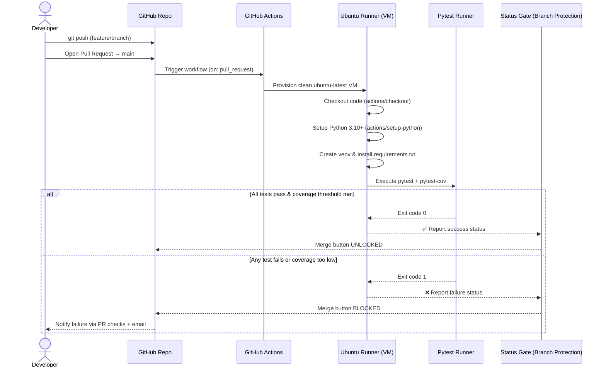

# Automated Unit Testing Pipeline
 
**A CI-enforced quality gate for Python numerical and tensor-based codebases.**
 
---
 
## 📌 Purpose
 
This repository implements an **Automated Unit Testing Pipeline** built on `pytest` and **GitHub Actions**. Its sole mission is to act as an automated gatekeeper on every Pull Request, catching issues *before* they reach `main`:
 
- ❌ **Broken mathematical logic** (incorrect formulas, off-by-one errors, sign flips)
- ❌ **Tensor / array shape mismatches** (dimension mismatches that silently corrupt downstream computation)
- ❌ **Code regressions** (previously passing behavior breaking due to new changes)
If any of the above occur, the pipeline fails the check, blocks the merge button on GitHub, and requires the author to fix the issue before the PR can be merged into `main`.
 
This project is maintained by a **4-person engineering team** and is designed to remain stable and low-maintenance across a **15–16 month product lifecycle**.
 
---
 
## 🏷️ Status Badges
 
```markdown


```
 
Rendered:
 


 
> Replace `<ORG_NAME>/<REPO_NAME>` with your actual GitHub organization and repository name.
 
---
 
## 🧭 Architecture Diagram
 
The diagram below shows the full lifecycle of a code change, from a developer's local push through to the final merge decision.
 

 
---
 
## 📂 Project Directory Structure
 
```text
.
├── .github/
│   └── workflows/
│       └── test.yml               # GitHub Actions CI pipeline definition
│
├── operations.py
│
├── test_operations.py 
│
├── requirements.txt                 # Runtime dependencies
├── .gitignore
├── README.md                        # This file
├── ARCHITECTURE.md                  # Pipeline & infrastructure design
├── TESTING_GUIDE.md                 # How to write and run tests
└── CONTRIBUTING.md                  # Developer workflow & PR standards
```
 
---
 
## 🚀 Quickstart Guide (Local Development)
 
Follow these steps to run the exact same checks locally that GitHub Actions will run on your PR.
 
### 1. Clone the repository
 
```bash
git clone https://github.com/<ORG_NAME>/<REPO_NAME>.git
cd <REPO_NAME>
```
 
### 2. Create and activate a virtual environment
 
```bash
python3.10 -m venv venv
 
# macOS / Linux
source venv/bin/activate
 
# Windows (PowerShell)
venv\Scripts\Activate.ps1
```
 
### 3. Install dependencies
 
```bash
pip install --upgrade pip
pip install -r requirements.txt
pip install -r requirements-dev.txt
```
 
**`requirements-dev.txt`** contains:
 
```text
pytest==8.3.3
pytest-cov==5.0.0
numpy==1.26.4
black==24.8.0
flake8==7.1.1
```
 
### 4. Run the full test suite locally
 
```bash
pytest
```
 
### 5. Run tests with coverage (mirrors CI exactly)
 
```bash
pytest --cov=src --cov-report=term-missing --cov-fail-under=85
```
 
### 6. Format and lint before committing
 
```bash
black src/ tests/
flake8 src/ tests/
```
 
If steps 4–6 all pass locally, your PR is highly likely to pass CI.
 
---
 
## 🔐 CI/CD Summary: How Merging Gets Blocked
 
1. Every push to a Pull Request branch automatically triggers `.github/workflows/test.yml`.
2. GitHub Actions spins up a **fresh, isolated `ubuntu-latest` virtual machine** — no leftover state from prior runs.
3. The workflow installs the exact dependency versions pinned in `requirements.txt` / `requirements-dev.txt`.
4. `pytest` executes the entire test suite, including:
   - Mathematical correctness checks
   - Tensor/array shape validation checks
   - Regression tests for previously fixed bugs
5. `pytest-cov` measures line coverage and **fails the build** if coverage drops below the configured threshold (default: `85%`).
6. The final job status (`success` or `failure`) is reported back to GitHub as a **required status check**.
7. Because this check is registered under **Branch Protection Rules** (see `ARCHITECTURE.md`), GitHub **physically disables the "Merge" button** on the PR until the check turns green.
8. No human can bypass this by accident — only repository admins can override it, and doing so is logged in the PR's audit trail.
➡️ For a deep technical breakdown of the workflow file, see [`ARCHITECTURE.md`](./ARCHITECTURE.md).
➡️ For how to write high-quality tests, see [`TESTING_GUIDE.md`](./TESTING_GUIDE.md).
➡️ For PR submission standards, see [`CONTRIBUTING.md`](./CONTRIBUTING.md).
